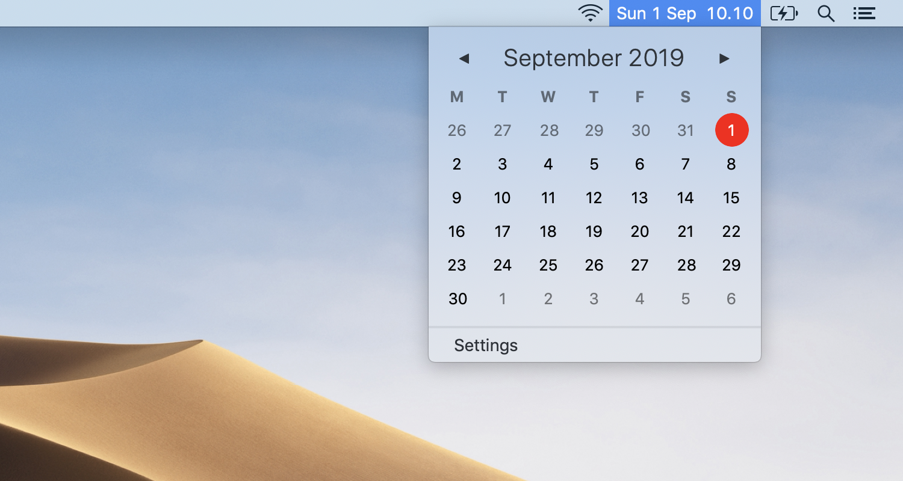

# CornerCal - a better clock app for macOS

Download latest version: [CornerCal.dmg.zip](https://github.com/ekreutz/CornerCal/raw/master/builds/CornerCal.dmg.zip) (supports macOS Sierra 10.12 and higher)

A simple, clean calendar and clock app for macOS. Inspired by [Itsycal](https://github.com/sfsam/Itsycal), but purposefully constructed to be a lot simpler and adhere to macOS' native styles.

*Pro tip:* In macOS Sierra and later, you can reorganize your status bar by holding `⌘` while dragging things around. You can also hide the native clock app from the system settings, in order to avoid clutter. 

Note: this app looks great in Mojave's Dark Mode as well!

___

# Development

The app is written in Swift 4.

Upcoming features:

- Keyboard shortcuts to click through calendar

Features that you won't see in CornerCal (at least not by me!):

- Custom calendar features such as events and reminders.
- Heavy themes that don't fit the style of macOS
